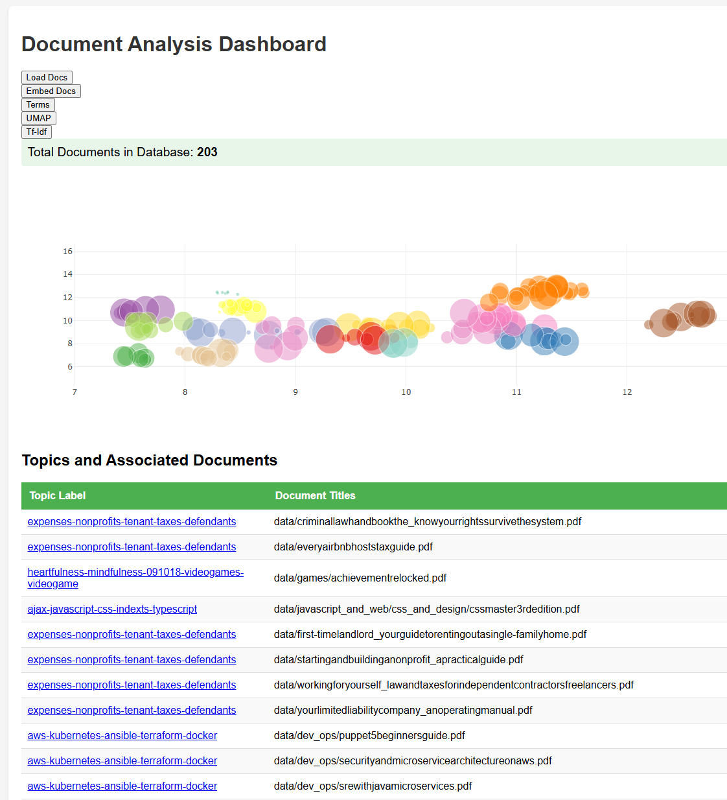

# LatentTopicExplorer

Application to discover and explore topics in a PDF corpus using machine learning and natural language processing. 



## Overview

LatentTopicExplorer is a Docker-based application that enables automated topic discovery and exploration from PDF document collections. The system extracts text from PDFs, performs clustering analysis, and generates interactive visualizations to help you understand the thematic structure of your document corpus.

### Key Features

- **PDF Text Extraction**: Automated extraction using pdfplumber
- **Document Embeddings**: 384-dimensional sentence embeddings via sentence_transformers
- **Chunked Processing**: Text split into 100-character chunks with 10-character overlap
- **Dimensionality Reduction**: UMAP algorithm for 2D visualization
- **Cluster Detection**: HDBSCAN for automated topic identification
- **Topic Labeling**: TF-IDF-based topic naming using top representative terms
- **Interactive Dashboard**: Plotly-powered Flask web interface
- **Asynchronous Processing**: Redis-based task queue for background processing

## Architecture

The application consists of **four Docker services**:

1. **PostgreSQL Database** (port 5432): Stores documents, embeddings, topics, and term analysis
2. **Redis Message Queue**: Manages asynchronous task processing
3. **Python Worker** (`nlp_pipeline`): Background worker that processes ML/NLP tasks
4. **Flask Web App** (port 8000): Web interface for triggering tasks and visualizing results

### How It Works

The Flask app provides a web interface where users can trigger processing tasks by clicking buttons. Each button pushes a task onto the Redis queue, which the Python worker picks up and executes asynchronously. This architecture allows long-running ML tasks to run in the background without blocking the web interface.

## Quick Start

### Prerequisites

- Docker and Docker Compose installed
- PDF documents to analyze
- Sufficient RAM (10GB allocated to nlp_pipeline container)

### Installation

1. Clone the repository:
```bash
git clone https://github.com/johnwatson11218/LatentTopicExplorer.git
cd LatentTopicExplorer
```

2. Place your PDF files in the `data/` directory

3. Start the application:
```bash
docker compose up -d
```

4. Wait for all services to initialize:
```bash
# Watch the logs
docker compose logs -f

# Check service health
docker compose ps
```

### Accessing the Application

Once all services are running, open your browser to:

**http://localhost:8000**

You'll see the main dashboard with buttons to execute each pipeline step.

## Pipeline Execution

**Important**: Execute these steps **in order** by clicking the corresponding buttons in the Flask web interface. Monitor the `nlp_pipeline` container logs to confirm completion before proceeding to the next step.

```bash
# Monitor worker logs in a separate terminal
docker compose logs -f nlp_pipeline
```

### Pipeline Steps

Execute each step by clicking the button in the web UI at `http://localhost:8000`:

#### 1. **Load Documents** (`/load_docs`)
- Scans the `data/` folder for PDF files
- Extracts text using pdfplumber
- Cleans and sanitizes text (removes null bytes, control characters)
- Stores full text in the `documents` table
- Tracks: filename, title, page count, raw text

#### 2. **Create Embeddings** (`/embed_docs`)
- Chunks each document's text into 100-character segments (10-char overlap)
- Creates 384D embeddings for each chunk using sentence_transformers
- Stores chunks in `chunked_embeddings` table
- Computes document-level embeddings by averaging all chunk embeddings
- Updates `documents` table with aggregated embedding

#### 3. **Apply UMAP** (`/umap`)
- Fetches all document embeddings from the database
- Applies UMAP dimensionality reduction to 2D
- Parameters: n_neighbors=15, min_dist=0.1, metric='cosine'
- Generates (x, y) coordinates for visualization
- Stores coordinates in `doc_coords` table

#### 4. **Identify Topics** (`/topics`)
- Runs HDBSCAN clustering on the 2D UMAP coordinates
- Parameters: min_cluster_size=5, min_samples=1
- Assigns each document to a topic cluster (or -1 for noise)
- Creates `document_topics` mapping table
- Reports number of clusters and noise points

#### 5. **Extract Terms** (`/terms`)
- Uses SpaCy NLP to extract meaningful terms from documents
- Calls PostgreSQL stored procedure: `simple_terms_parser()`
- Builds `terms` and `document_terms` relationship tables
- Tracks term frequency per document

#### 6. **Calculate TF-IDF** (`/tf_idf`)
- Computes class-based TF-IDF scores for each topic
- Calls PostgreSQL stored procedure: `refresh_topic_tables()`
- Identifies top 5 representative terms per topic
- Stores results in `topic_top_terms` table
- These top terms become the topic labels

### Viewing Results

After completing all pipeline steps, the main dashboard (`http://localhost:8000`) will display:

- **Interactive scatter plot**: Documents plotted by UMAP coordinates
- **Color-coded clusters**: Each topic has a distinct color
- **Topic labels**: Displayed with top 5 TF-IDF terms
- **Document list**: Shows which documents belong to each topic
- **Hover information**: Document titles and metadata
- **Clickable markers**: Navigate to individual document views
- **Marker sizing**: Scaled by document length

## Data Processing Details

### Text Processing Pipeline

```
PDFs → pdfplumber → Text Cleaning → Database Storage
                                        ↓
                                   Chunking (100 chars, 10 overlap)
                                        ↓
                                   Embeddings (384D)
                                        ↓
                               Document Embedding (mean pooling)
                                        ↓
                                   UMAP (2D projection)
                                        ↓
                                   HDBSCAN (clustering)
                                        ↓
                                      Topics
                                        ↓
                               SpaCy NLP → Terms
                                        ↓
                                   TF-IDF → Labels
```

### Technical Specifications

- **Chunking**: 100-character segments, 10-character overlap
- **Embedding Model**: sentence_transformers (384 dimensions)
- **Document Embedding**: Mean pooling of all chunk embeddings
- **Dimensionality Reduction**: UMAP with cosine metric
- **Clustering**: HDBSCAN (density-based, euclidean metric)
- **Topic Labeling**: Top 5 terms by class-based TF-IDF score
- **Text Cleaning**: Removes null bytes, control characters; clips to byte limits

### Database Schema

**Main Tables:**

- `documents`: Stores PDF metadata, raw text, and document embeddings
- `chunked_embeddings`: Child table with text chunks and their embeddings
- `doc_coords`: UMAP (x, y) coordinates per document
- `document_topics`: Maps documents to topic clusters
- `terms`: All extracted terms from the corpus
- `document_terms`: Term frequency per document
- `topic_top_terms`: Top 5 TF-IDF terms per topic (used as labels)

**Stored Procedures:**

- `simple_terms_parser()`: SpaCy-based term extraction
- `refresh_topic_tables()`: TF-IDF calculation and topic labeling

## Configuration

### Environment Variables

Set in `docker-compose.yml`:

```yaml
# Database Configuration
POSTGRES_DB: second_brain
POSTGRES_USER: postgres
POSTGRES_PASSWORD: test_case

# Redis Configuration
REDIS_URL: redis://redis:6379
```

### Resource Limits

The `nlp_pipeline` container is allocated:
- Memory: 10GB
- Memory + Swap: 10GB

Adjust in `docker-compose.yml` if needed:

```yaml
nlp_pipeline:
  mem_limit: 10g
  memswap_limit: 10g
```

## Development

### Project Structure

```
LatentTopicExplorer/
├── data/                       # Place PDFs here
├── flask_app/                  # Web interface
│   ├── app.py                  # Flask routes and UI logic
│   ├── templates/              # HTML templates
│   └── Dockerfile
├── nlp_pipeline/               # ML worker
│   ├── worker.py               # Background task processor
│   ├── sql/                    # Database initialization scripts
│   └── Dockerfile
├── docker-compose.yml          # Service orchestration
└── README.md
```

### Task Queue Architecture

**Flask App (`flask_app/app.py`):**
- Provides web routes like `/load_docs`, `/embed_docs`, etc.
- Each route pushes a JSON task onto the Redis `python_tasks` queue
- Example: `redis_client.rpush('python_tasks', json.dumps({'task': 'umap'}))`
- Returns immediately with a flash message

**Worker (`nlp_pipeline/worker.py`):**
- Continuously monitors the Redis `python_tasks` queue
- Pops tasks and executes corresponding functions
- Handles all heavy ML/NLP processing
- Logs progress and errors

### Monitoring

```bash
# View all service logs
docker compose logs -f

# View specific service
docker compose logs -f nlp_pipeline
docker compose logs -f flask_app
docker compose logs -f postgres
docker compose logs -f redis

# Check service status
docker compose ps

# Execute SQL queries
docker compose exec postgres psql -U postgres -d second_brain
```

### Stopping the Application

```bash
# Stop all services
docker compose down

# Remove volumes (WARNING: deletes all data)
docker compose down -v
```

## Troubleshooting

### PDFs Fail to Import

**Symptoms**: Worker logs show errors or import process stalls

**Solutions**:
- Check worker logs: `docker compose logs nlp_pipeline`
- Remove problematic PDFs from `data/` directory
- Verify PDFs are not corrupted or password-protected
- Check available disk space

### Database Connection Issues

**Symptoms**: Worker cannot connect to PostgreSQL

**Solutions**:
- Ensure PostgreSQL is healthy: `docker compose ps`
- Check database logs: `docker compose logs postgres`
- Verify environment variables in `docker-compose.yml`
- Wait for healthcheck to pass before starting worker

### Redis Connection Failed

**Symptoms**: Worker cannot push/pop tasks

**Solutions**:
- Check Redis status: `docker compose ps redis`
- Verify `REDIS_URL` environment variable
- Restart Redis: `docker compose restart redis`

### Empty or Incorrect Visualization

**Symptoms**: Dashboard shows no data or incorrect clusters

**Solutions**:
- Verify all pipeline steps completed successfully
- Check worker logs for errors during each step
- Ensure PDFs were loaded: `docker compose exec postgres psql -U postgres -d second_brain -c "SELECT COUNT(*) FROM documents;"`
- Verify embeddings exist: `SELECT COUNT(*) FROM documents WHERE embedding IS NOT NULL;`
- Check topic assignments: `SELECT COUNT(*) FROM document_topics;`

### Memory Issues

**Symptoms**: Worker crashes or OOM (out of memory) errors

**Solutions**:
- Increase memory limits in `docker-compose.yml` (currently 10GB)
- Process fewer documents at once
- Use smaller embedding models
- Monitor memory: `docker stats`

### Tasks Not Processing

**Symptoms**: Clicking buttons does nothing

**Solutions**:
- Check worker is running: `docker compose ps nlp_pipeline`
- View worker logs for errors: `docker compose logs -f nlp_pipeline`
- Verify Redis connection
- Restart worker: `docker compose restart nlp_pipeline`

## API Endpoints

The Flask app exposes these routes at `http://localhost:8000`:

| Endpoint | Method | Description |
|----------|--------|-------------|
| `/` | GET | Main dashboard with visualization |
| `/load_docs` | GET | Queue PDF loading task |
| `/embed_docs` | GET | Queue embedding creation task |
| `/umap` | GET | Queue UMAP projection task |
| `/topics` | GET | Queue HDBSCAN clustering task |
| `/terms` | GET | Queue term extraction task |
| `/tf_idf` | GET | Queue TF-IDF calculation task |

## Technologies Used

### Python Libraries

- **pdfplumber**: PDF text extraction
- **sentence-transformers**: Document embeddings
- **UMAP-learn**: Dimensionality reduction
- **scikit-learn**: HDBSCAN clustering
- **SpaCy**: NLP and term extraction
- **NumPy**: Numerical operations
- **Pandas**: Data manipulation
- **Matplotlib/Seaborn**: Color generation
- **Plotly**: Interactive visualizations

### Infrastructure

- **PostgreSQL 16**: Relational database with vector support
- **Redis**: Message queue and task broker
- **Flask**: Web framework
- **Docker & Docker Compose**: Containerization and orchestration

## Performance Considerations

- **Embedding Generation**: Most time-consuming step (depends on corpus size)
- **UMAP**: Computationally expensive for large datasets (>10,000 docs)
- **Memory**: 10GB allocated for ML processing
- **Disk I/O**: PDF reading can be slow for large files
- **Task Queue**: Asynchronous processing prevents UI blocking

### Optimization Tips

1. **Smaller Batches**: Process PDFs in smaller batches if memory-constrained
2. **GPU Acceleration**: Use GPU-enabled sentence-transformers for faster embeddings
3. **UMAP Parameters**: Adjust `n_neighbors` for speed vs. quality tradeoff
4. **Chunk Size**: Larger chunks = fewer embeddings = faster processing
5. **Database Indexes**: Ensure proper indexes on `document_id`, `topic_id`

## Future Enhancements

Potential improvements:
- [ ] Streaming progress updates to UI via WebSockets
- [ ] Support for additional document formats (DOCX, TXT, HTML)
- [ ] Configurable chunking and embedding parameters via UI
- [ ] Topic merging and manual relabeling
- [ ] Document search and filtering
- [ ] Export functionality (CSV, JSON)
- [ ] Authentication and multi-user support
- [ ] Incremental updates (add new docs without reprocessing)

## License

This project is licensed under the MIT License - see the [LICENSE](LICENSE) file for details.

## Contributing

Contributions are welcome! Please feel free to submit issues or pull requests.

## Acknowledgments

Built with:
- [pdfplumber](https://github.com/jsvine/pdfplumber) - PDF text extraction
- [sentence-transformers](https://www.sbert.net/) - Document embeddings
- [UMAP](https://umap-learn.readthedocs.io/) - Dimensionality reduction
- [HDBSCAN](https://hdbscan.readthedocs.io/) - Density-based clustering
- [SpaCy](https://spacy.io/) - NLP and term extraction
- [Plotly](https://plotly.com/) - Interactive visualizations
- [PostgreSQL](https://www.postgresql.org/) - Data storage
- [Redis](https://redis.io/) - Task queue management
- [Flask](https://flask.palletsprojects.com/) - Web framework